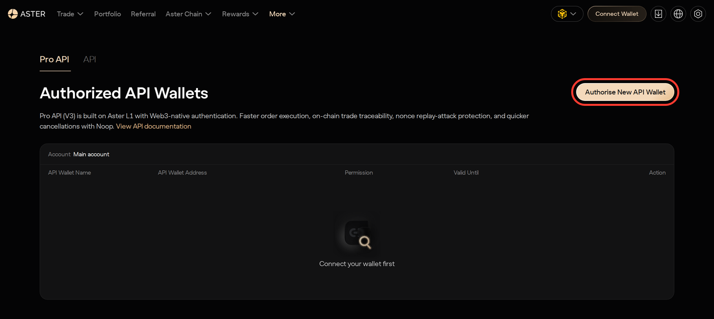
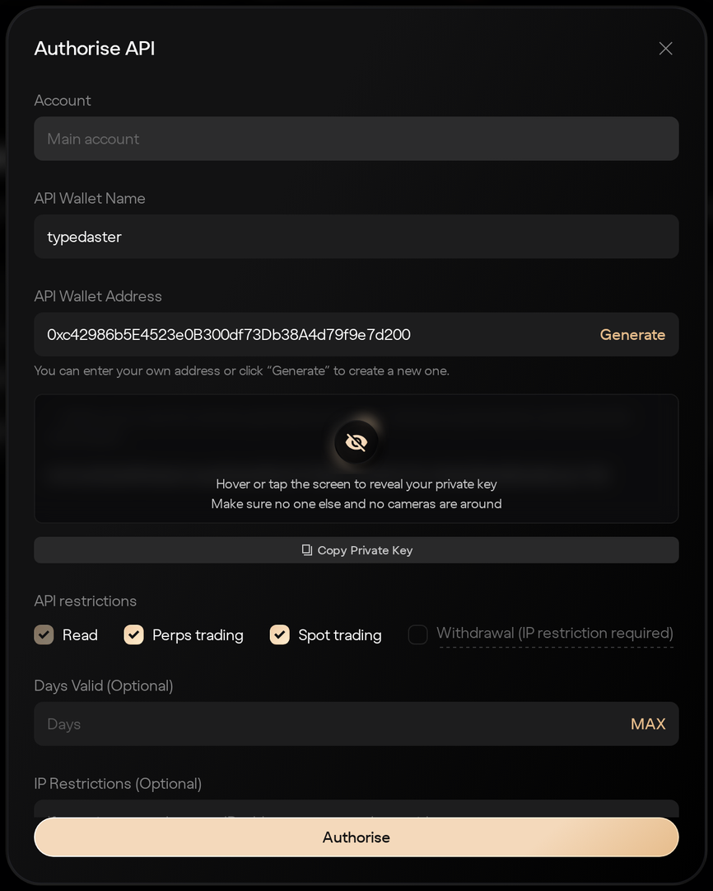

# Authenticated Setup

Aster has no API key and secret. Signed requests use two EVM wallets:

- the **main wallet** (`user`): your Aster account.
- an **API wallet** (an agent, `signer`): a separate key that the main wallet approves.
  It signs every trading and account request.

## Create An API Wallet

Connect your main wallet on the [API wallet page](https://www.asterdex.com/en/api-wallet)
and click **Authorise New API Wallet**. Name it, click **Generate** to create a fresh address,
choose its permissions (spot trading, perpetual trading, withdrawals) and an optional expiry,
then copy the private key and click **Authorise**:

| 1) Authorise a new API wallet | 2) Generate it and copy the private key |
| ----------------------------- | --------------------------------------- |
|  |  |

You can also do it from code. The main wallet signs the call, so no API wallet is needed yet:

```python
from datetime import datetime, timedelta, timezone

from eth_account import Account
from typed_aster import Aster

agent = Account.create()

async with Aster.new(main='0x...main-wallet-private-key') as client:
  await client.futures.agents.register(
    agent_name='bot',
    agent_address=agent.address,
    expired=datetime.now(timezone.utc) + timedelta(days=90),
    can_spot_trade=True,
    can_perp_trade=True,
    can_withdraw=False,
  )
```

Signed calls fail with `AuthError` (code `-5050`) until the main wallet has made a deposit.

## Environment Variables

```bash
ASTER_USER="0x...main-wallet-address"
ASTER_SIGNER="0x...api-wallet-address"
ASTER_SIGNER_PRIVATE_KEY="0x...api-wallet-private-key"
# Optional: only for agent, builder and sub-account management, staking and withdrawals
ASTER_USER_PRIVATE_KEY="0x...main-wallet-private-key"
```

With these set, `Aster.new()` needs no arguments:

```python
from typed_aster import Aster

async with Aster.new() as client:
  print(await client.futures.account.balance())
```

## Direct Usage

Arguments take precedence over the environment. `signer` and `main` accept a hex private key or
an `eth_account` account:

```python
from typed_aster import Aster

client = Aster.new(
  user='0x...main-wallet-address',
  signer='0x...api-wallet-private-key',
)
```

Pass `mainnet=False` to use Aster's testnet. Aster Chain has no testnet, so on a testnet
client only its public calls work.

For market data alone, skip credentials with `Aster.new(public=True)`.

## Security Notes

- give the API wallet only the permissions it needs; leave withdrawals off unless required
- keep the main wallet key out of automated processes that only trade
- never commit private keys to git
