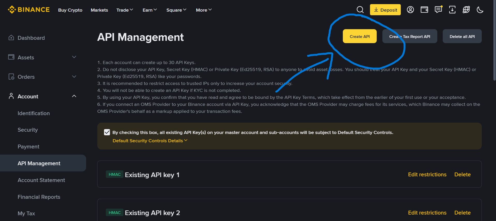
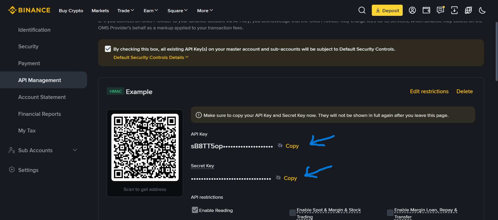

# API Keys Setup

`Binance.new()` reads credentials from the environment by default.

You can get your API keys from the [Binance website](https://www.binance.com/en/my/settings/api-management):

| 1) Create API keys                                  | 2) Copy API & Secret key |
| --------------------------------------------------- | --------------------------------------------------- |
| |  |

## Environment Variables

```bash
export BINANCE_API_KEY="your_api_key"
export BINANCE_SECRET_KEY="your_api_secret"
```

```python
from typed_binance import Binance

async with Binance.new() as client:
  account = await client.spot.http.account.info()
  print(account['balances'])
```

## Passing Credentials Directly

```python
from typed_binance import Binance

async with Binance.new(api_key='your_api_key', secret_key='your_api_secret') as client:
  ...
```

## Public-Only Access

Market data and other public endpoints need no credentials:

```python
from typed_binance import Binance

async with Binance.new(public=True) as client:
  price = await client.spot.http.market.ticker_price(symbol='BTCUSDT')
```

## Notes

- Binance signs authenticated requests with HMAC-SHA256; this client does not support RSA or Ed25519 keys.
- One key/secret pair authenticates every product — spot, USD-M futures, COIN-M futures, options, portfolio margin — and the WS API, since Binance's signing scheme is uniform across all of them.
- `Binance.new(recv_window=...)` sets `recvWindow` (in milliseconds) on every signed request; Binance defaults to 5000ms when it is left unset.
