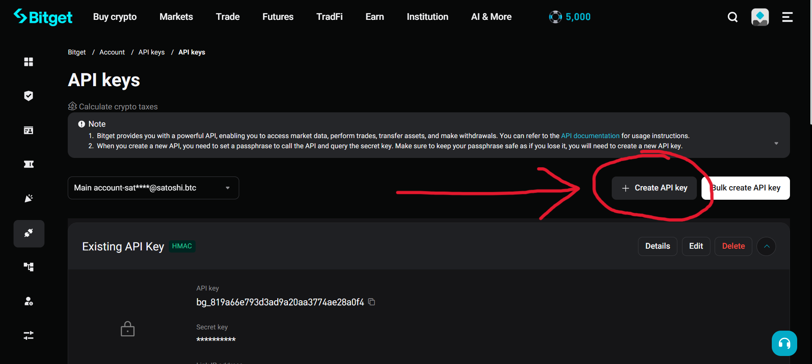
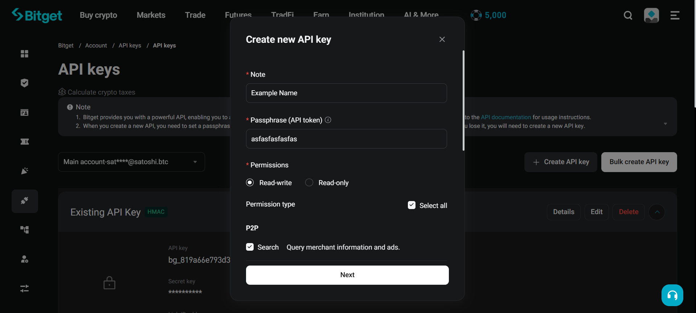
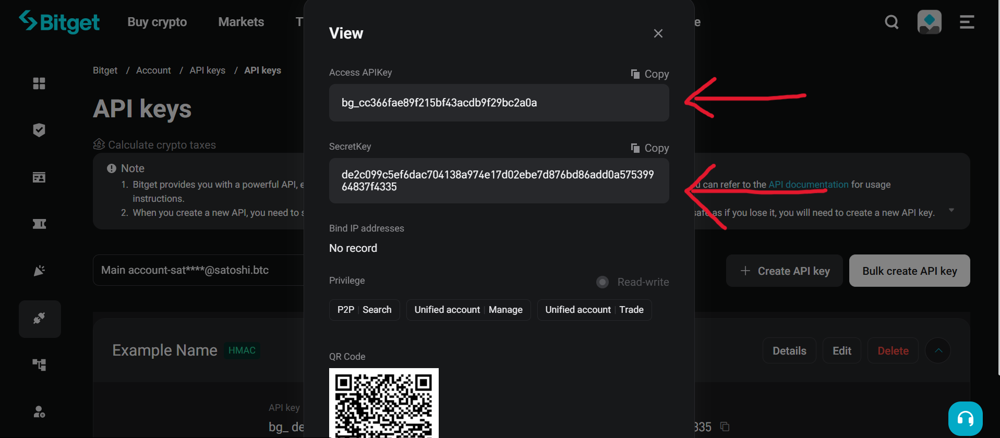

# API Keys Setup

Authenticated calls need an access key, secret key, and passphrase from the Bitget API
management page. You can get your API keys from the [Bitget website](https://www.bitget.com/account/newapi):

| 1) Create API keys | 2) Set passphrase & permissions | 3) Copy API & Secret key |
| ----------------- | -------------------------------- | ------------------------ |
|  |  |  |

## Environment Variables

```bash
export BITGET_ACCESS_KEY="your_access_key"
export BITGET_SECRET_KEY="your_secret_key"
export BITGET_PASSPHRASE="your_passphrase"
```

```python
from typed_bitget import Bitget

async with Bitget.new() as client:
  ...
```

## Direct Usage

You can also pass credentials directly, bypassing the environment:

```python
from typed_bitget import Bitget

async with Bitget.new(
  access_key="your_access_key",
  secret_key="your_secret_key",
  passphrase="your_passphrase",
) as client:
  ...
```

## Public-Only Usage

For public endpoints only, skip credentials entirely:

```python
from typed_bitget import Bitget

async with Bitget.new(public=True) as client:
  ...
```

Calling an authenticated method on a `public=True` client raises `AuthError`.

## Security Notes

- never commit credentials to git
- restrict a key's IP allowlist and permissions to what you actually need
- keep trading and withdrawal permissions on separate keys
