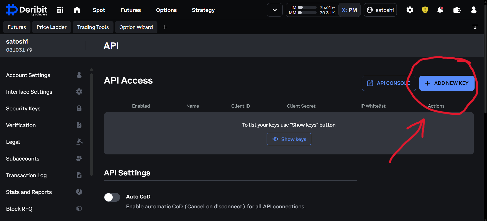
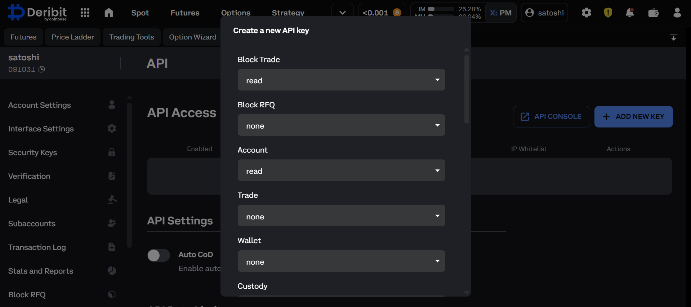
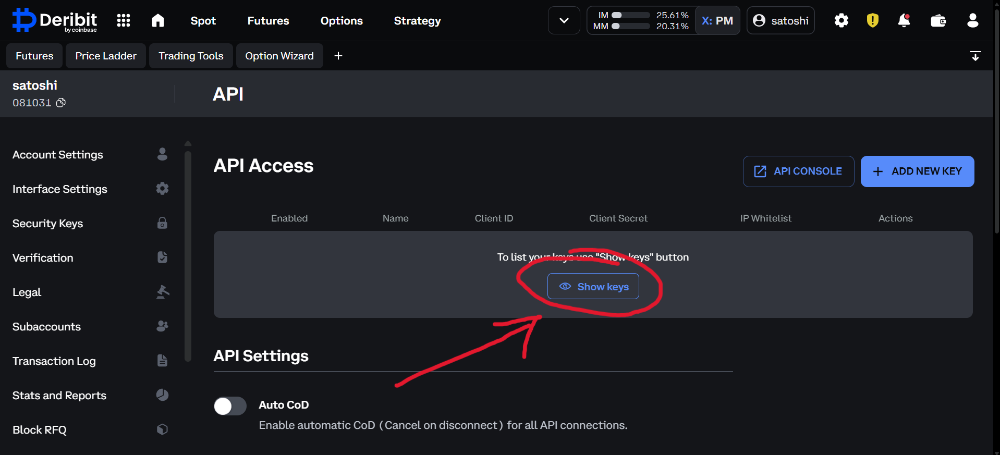
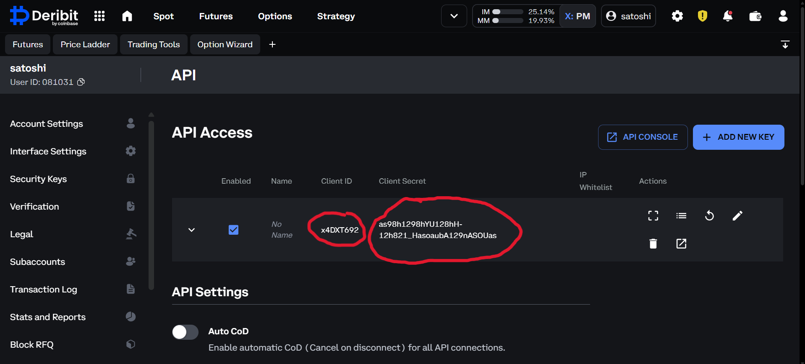

# API Keys Setup

Authenticated calls (`private/*` methods, `authed_subscribe` channels) need a Deribit
`client_id`/`client_secret` pair. Public methods and public channel subscriptions need
neither.
## Create API Credentials

Create a client id and secret from [Deribit's API management page](https://www.deribit.com/account/BTC/api):

| 1) Create API keys | 2) Select permissions |
| ------------------ | --------------------- |
|  |  |
| 3) Show API keys | 4) Copy API keys |
|  |  |

## Environment Variables

```bash
export DERIBIT_CLIENT_ID="your_client_id"
export DERIBIT_CLIENT_SECRET="your_client_secret"
```

`Deribit.new(testnet=True)` reads the `TEST_`-prefixed pair instead:

```bash
export TEST_DERIBIT_CLIENT_ID="your_testnet_client_id"
export TEST_DERIBIT_CLIENT_SECRET="your_testnet_client_secret"
```

## Usage

```python
from typed_deribit import Deribit

async with Deribit.new(testnet=True) as client:
  summary = await client.account.get_account_summary(currency='BTC')
  print(summary)
```

Credentials also pass directly, which skips the environment lookup:

```python
from typed_deribit import Deribit

async with Deribit.new(
  client_id='your_client_id', client_secret='your_client_secret', testnet=True,
) as client:
  summary = await client.account.get_account_summary(currency='BTC')
```

A client built with `public=True` skips credential resolution entirely and can only reach
public methods and public channels:

```python
from typed_deribit import Deribit

async with Deribit.new(public=True) as client:
  ticker = await client.market_data.ticker(instrument_name='BTC-PERPETUAL')
```

## HTTP Auth Scheme

The HTTP connection defaults to Bearer-token auth (`public/auth` token exchange, cached
and refreshed automatically). Pass `http_auth='hmac'` to sign every request individually
instead (`client_signature` grant, no token exchange):

```python
from typed_deribit import Deribit

async with Deribit.new(testnet=True, http_auth='hmac') as client:
  summary = await client.account.get_account_summary(currency='BTC')
```

The WebSocket connection (`transport='ws'`) and `.streams` always use token auth;
`http_auth` only affects the HTTP connection.

See [Environment Variables](reference/env-vars.md) for the full variable list and
[Error Handling](reference/error-handling.md) for what a missing or rejected credential
raises.
