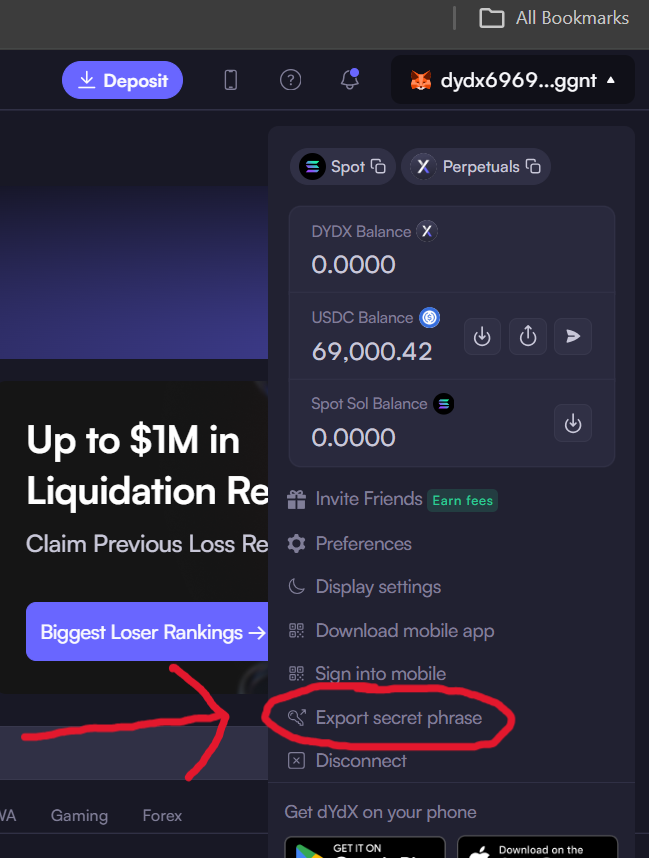

# Wallet Setup

dYdX node write workflows use a Cosmos wallet mnemonic for signing
transactions. Public indexer and chain reads do not require credentials.

You can export your secret mnemonic from the [dYdX website](https://dydx.trade/):




## Environment Variables

The recommended setup is an environment variable:

```bash
export DYDX_MNEMONIC='your wallet mnemonic'
export DYDX_TESTNET_MNEMONIC='your testnet wallet mnemonic'
```

Public indexer and chain queries can run without a wallet by passing
`public=True`.

## Direct Usage

You can also pass the mnemonic directly:

```python
from dydx import Dydx

async with Dydx.testnet('your testnet mnemonic') as client:
  await client.node.refresh_wallet()
  print(client.node.wallet.address)
```

When a mnemonic is omitted, mainnet constructors read `DYDX_MNEMONIC` and
testnet constructors read `DYDX_TESTNET_MNEMONIC`.

## Write Workflows

Order placement, cancellation, and raw transaction signing require a wallet.
Use `simulate=True` while validating order flows against testnet.

## Security Notes

- never commit credentials to git
- prefer `public=True` for read-only scripts
- use a separate testnet wallet for development
- simulate new transaction flows before broadcasting
- rotate credentials after any suspected leak

## Troubleshooting

If authenticated requests fail:

- confirm the mnemonic belongs to a funded dYdX account
- confirm your environment variables are loaded
- check [Error Handling](reference/error-handling.md) for the client error model
