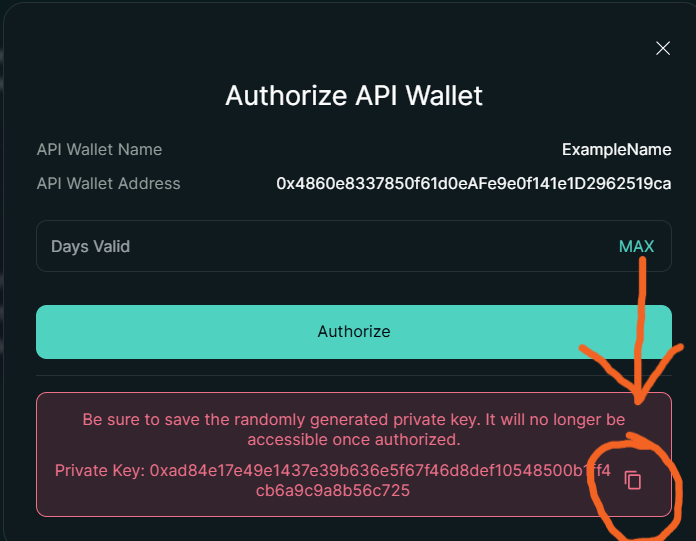

# Authenticated Setup

Public reads and public streams can use `public=True` without credentials:

```python
from typed_hyperliquid import Hyperliquid

async with Hyperliquid.new(public=True) as client:
  mids = await client.info.all_mids()
```

Otherwise, we recommend using "API wallets" instead of your actual private key. You can create them from the [Hyperliquid website](https://app.hyperliquid.xyz/API).

Authorize the API wallet and then copy the private key, as shown in the screenshot below:



## Environment Variable

For authenticated exchange actions, set your private key:

```bash
export HYPERLIQUID_PRIVATE_KEY="api_wallet_private_key"
```

Then construct `Hyperliquid` normally:

```python
from typed_hyperliquid import Hyperliquid

async with Hyperliquid.new() as client:
  result = await client.exchange.noop()
  print(result['type'])
```

For testnet, pass `mainnet=False` and set the testnet key:

```bash
export HYPERLIQUID_TESTNET_PRIVATE_KEY="testnet_private_key"
```

```python
from typed_hyperliquid import Hyperliquid

async with Hyperliquid.new(mainnet=False) as client:
  result = await client.exchange.noop()
  print(result['type'])
```

## Direct Wallet Usage

You can also pass a private key or wallet object directly:

```python
from typed_hyperliquid import Hyperliquid

async with Hyperliquid.new('0xyour_private_key') as client:
  result = await client.exchange.noop()
  print(result['type'])
```

## Security Notes

- Never commit private keys.
- Treat `HYPERLIQUID_PRIVATE_KEY` and `HYPERLIQUID_TESTNET_PRIVATE_KEY` as high-sensitivity secrets.
- Treat exchange examples as mainnet-sensitive unless you explicitly set `mainnet=False`.
