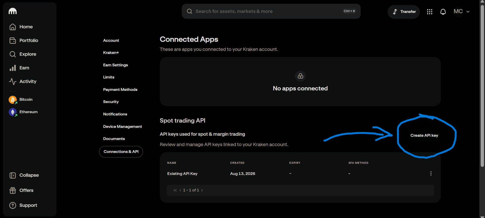
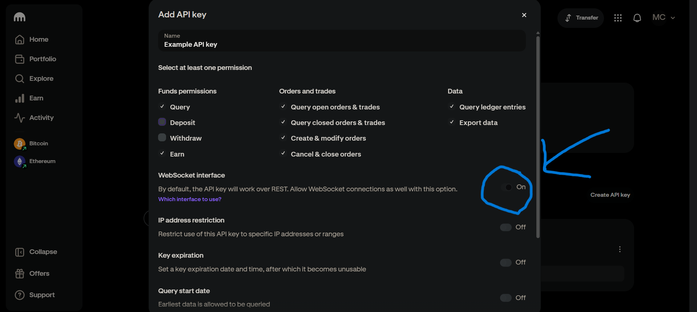
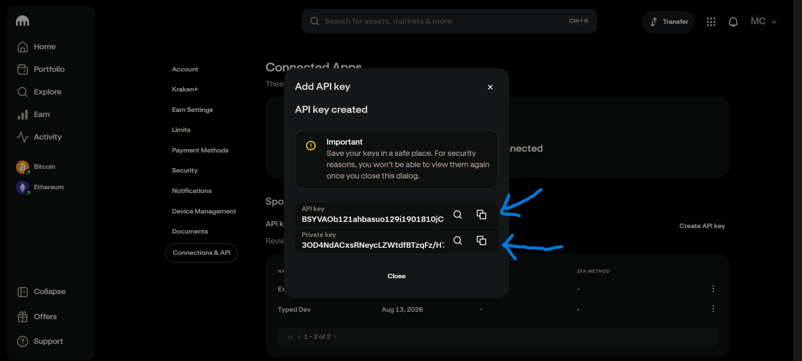

# API Keys Setup

Private `spot.account`, `spot.trading`, `spot.funding`, and `spot.earn` methods, plus
`streams.private` and `trading_ws`, need a Kraken API key pair. Public market data
needs none.

## Create An API Key

Generate a key pair from Kraken's [API management page](https://www.kraken.com/u/security/api).
Grant only the permissions your use case needs, and turn WebSocket on if you plan to use that:

| 1) Create API keys                                  | 2) Select permissions & Activate WS | 3) Copy API & Secret key |
| --------------------------------------------------- | --------------------------------------------------- | --------------------------------------------------- |
| |  |  |

## Environment Variables

```bash
export KRAKEN_API_KEY="..."
export KRAKEN_PRIVATE_KEY="..."
```

With both set, `Kraken.new()` picks them up automatically:

```python
from typed_kraken import Kraken

async with Kraken.new() as client:
  balance = await client.spot.account.balance()
  print(balance)
```

You can also pass them directly, which takes precedence over the environment:

```python
from typed_kraken import Kraken

async with Kraken.new(api_key='...', private_key='...') as client:
  ...
```

## Public-Only Usage

For a client that never authenticates -- no keys read from the environment, no
`AuthError` on private calls you never make -- pass `public=True`:

```python
from typed_kraken import Kraken

async with Kraken.new(public=True) as client:
  ticker = await client.spot.market_data.ticker(pair='XBTUSD')
```

## Withdrawal Addresses

If your key has withdrawal permission, Kraken also requires the destination address to be
pre-approved on the account -- `spot.funding.withdraw` takes an address *key name*, not a
raw address, and rejects anything not already whitelisted from the dashboard.
