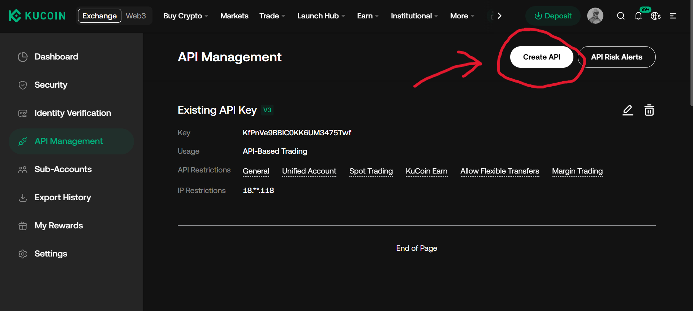
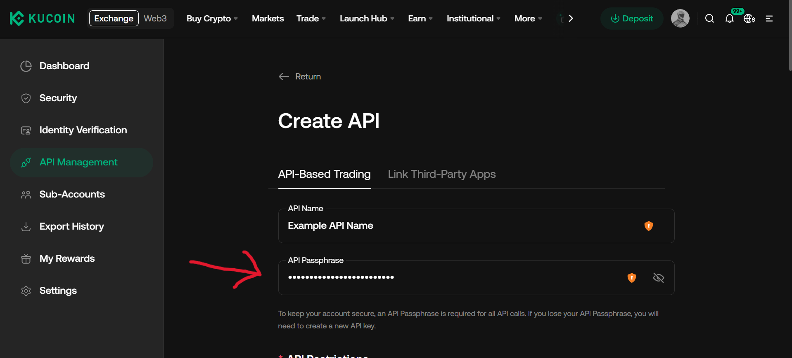
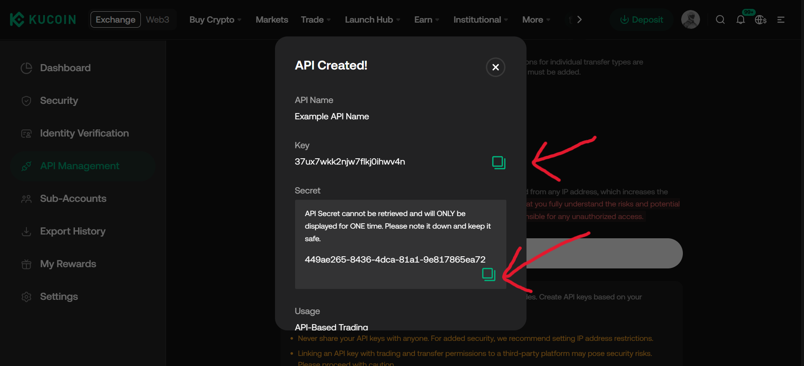

# API Keys Setup

You can get your API keys from the [KuCoin website](https://www.kucoin.com/account/api):

| 1) Create API keys | 2) Set passphrase & permissions | 3) Copy API key & secret |
| ----------------- | ------------------------------- | ------------------------ |
|  |  |  |

## Environment Variables

`KuCoin.new()` reads credentials from the environment by default:

```bash
export KUCOIN_API_KEY="..."
export KUCOIN_API_SECRET="..."
export KUCOIN_API_PASSPHRASE="..."
```

```python
from typed_kucoin import KuCoin

async with KuCoin.new() as client:
  info = await client.account.user_info()
  print(info)
```

All three are required for an authenticated client — KuCoin signs every private request
with the key, secret, and a passphrase that is itself HMAC-signed with the secret. See
[Environment Variables](reference/env-vars.md) for the full list.

## Passing Credentials Directly

```python
from typed_kucoin import KuCoin

async with KuCoin.new(
  api_key='...',
  api_secret='...',
  api_passphrase='...',
) as client:
  ...
```

## Public-Only Access

Market data, symbols, and server time don't need credentials. Pass `public=True` for a
client that never signs a request and works without any environment variables set:

```python
from typed_kucoin import KuCoin

async with KuCoin.new(public=True) as client:
  ticker = await client.spot.ticker(symbol='BTC-USDT')
  print(ticker)
```

A `public=True` client raises `AuthError` on any private endpoint or private WebSocket
topic, rather than attempting an unsigned request.

## Keeping Keys Safe

Never commit an API key, secret, or passphrase to git. Load them from an untracked
`.env` file or your environment's secret manager. If a key ever leaks, revoke it from
the KuCoin dashboard immediately — a leaked key with `Trade` permission can place real
orders on your account.
