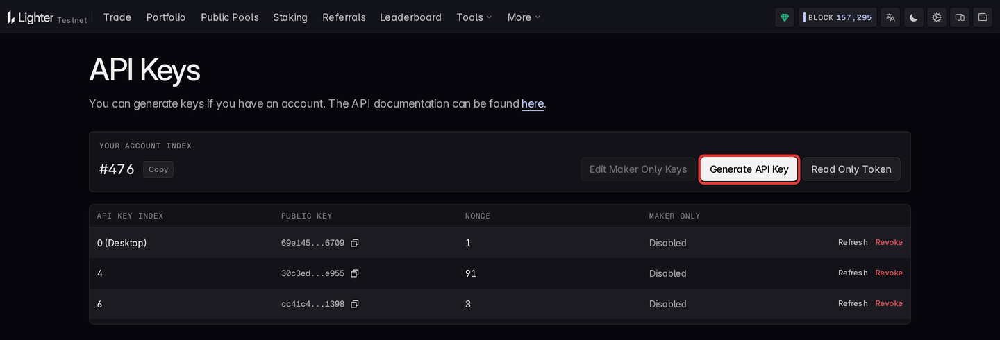
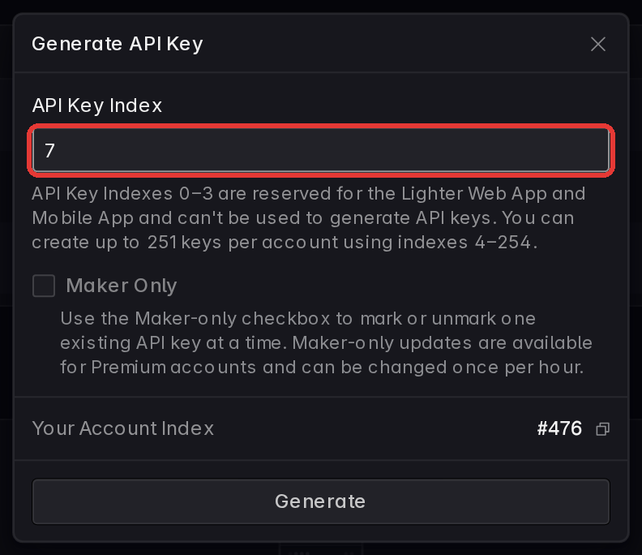
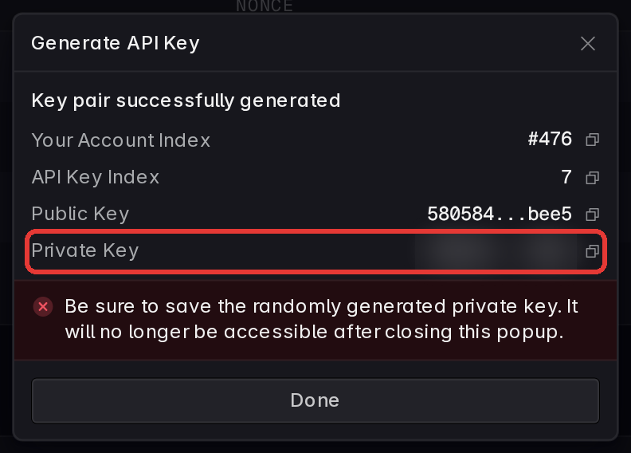
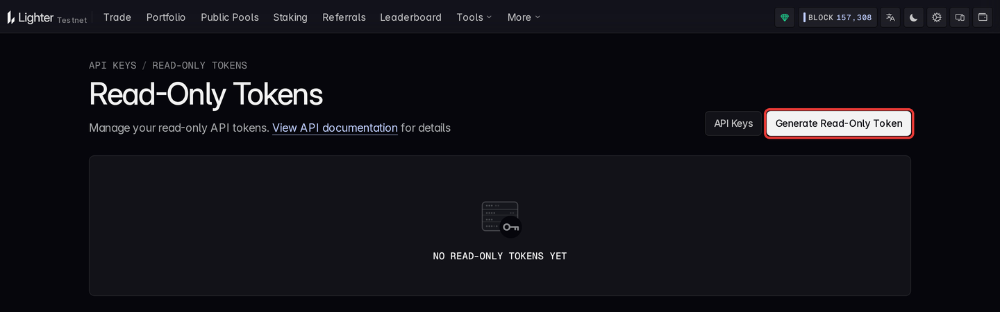

# Authenticated Setup

Lighter has no classic key/secret pair. An Ethereum wallet owns your Lighter account, but the
client never signs with the wallet key. It signs with an **API key**: a Lighter-specific
signing key (Schnorr over the ECgFp5 curve, not an Ethereum key) registered in one of your
account's key slots, `4` to `254`. Every slot has its **own nonce**, which the client tracks
for you.

## Create An API Key

Connect your wallet on Lighter's [API keys page](https://app.lighter.xyz/apikeys) and click
**Generate API Key**. Pick a free **API Key Index** from `4` to `254`, click **Generate**, and
approve the registration in your wallet. The dialog then shows the new key pair: copy the
**Private Key** before clicking **Done**.

| 1) Generate an API key | 2) Pick a free index | 3) Copy the private key |
| ---------------------- | -------------------- | ----------------------- |
|  |  |  |

- Indexes `0` to `3` are reserved for Lighter's web and mobile apps (connecting the wallet
  can register one of them, like `0 (Desktop)` above), so API keys go in `4` to `254`: up to
  251 keys per account.
- The private key is shown once. It is no longer accessible after closing the dialog; a lost
  key is replaced by generating a new one in the same or another slot.
- The wallet's signature authorizes the key, so the wallet's own private key is never
  entered anywhere.

The page only offers keys once the wallet has an account: an Ethereum wallet's Lighter
**master account** is created by its first deposit (there is no sign-up call). For testnet,
use the [testnet API keys page](https://testnet.app.lighter.xyz/apikeys); test funds come
from the [testnet app](https://testnet.app.lighter.xyz/).

## Find Your Account Index

Every account is addressed by an integer **account index**. The API keys page shows yours
under **Your Account Index** (`#476` above, without the `#`). From code, look it up by wallet
address, no credentials needed:

```python
from typed_lighter import Lighter

async with Lighter.new(public=True) as client:
  accounts = await client.api.account.by_l1_address(l1_address='0x0000000000000000000000000000000000000000')
  for account in accounts['sub_accounts']:  # master account first
    print(account['index'], account['collateral'])
```

A wallet can also own **sub-accounts**, each with its own index and its own API keys.

## Configure The Client

```bash
# .env
LIGHTER_ACCOUNT_INDEX="123"
LIGHTER_API_KEY_INDEX="4"
LIGHTER_API_PRIVATE_KEY="0x...api-private-key"
```

Paste the private key as the dialog shows it; the `0x` prefix is optional. Each network reads
its own prefix, so testnet credentials are `LIGHTER_TESTNET_ACCOUNT_INDEX`,
`LIGHTER_TESTNET_API_KEY_INDEX` and `LIGHTER_TESTNET_API_PRIVATE_KEY` (`LIGHTER_ROBINHOOD_*`
for the robinhood networks, see [Networks](#networks)).

With these set, `Lighter.new()` needs no arguments:

```python
from typed_lighter import Lighter

async with Lighter.new() as client:
  orders = await client.api.account.orders.active(account_index=client.signer.account_index)
  print(orders['orders'])
```

Arguments take precedence over the environment:

```python
from typed_lighter import Lighter

client = Lighter.new(
  network='testnet',
  account_index=123,
  api_key_index=4,
  api_private_key='0x...api-private-key',
)
```

Signing happens locally; the private key never leaves the process. For market data alone,
skip credentials with `Lighter.new(public=True)`.

## Read-Only Access

A **read-only token** (`ro:...`) lets a dashboard or a monitoring job read your account
without holding an API key. Create one on the
[read-only tokens page](https://app.lighter.xyz/read-only-tokens) (**Read Only Token** on the
API keys page), or from code with a client that has an API key:



```python
from datetime import datetime, timedelta, timezone

from typed_lighter import Lighter

async with Lighter.new() as client:
  created = await client.api.account.tokens.create(
    name='dashboard',
    account_index=client.signer.account_index,
    expiry=datetime.now(timezone.utc) + timedelta(days=30),
    sub_account_access=False,
  )

async with Lighter.new(auth_token=created['api_token']) as reader:  # or LIGHTER_AUTH_TOKEN
  print(reader.account_index)  # read from the token
  orders = await reader.api.account.orders.active(account_index=created['account_index'])
```

Read-only tokens allow private REST reads and private streams only: no transactions and no
token-gated writes. They are valid from 5 minutes up to 10 years, at most 10 per account.

## When You Also Need The Ethereum Key

Only these need `eth_private_key` (`LIGHTER_ETH_PRIVATE_KEY`); everything else runs on the
API key alone:

- `tx.change_api_key`
- `tx.transfer` to an account outside your own master account
- `tx.approve_integrator` with non-zero fee caps, for an integrator outside your master account
- `tx.fast_withdraw`
- `tx.lit_lease`

## Advanced

### Register API Keys From Code

Registering a key is itself a transaction, `change_api_key`, and it is the one that needs
the Ethereum wallet: the wallet's signature authorizes the new key. The new key signs the
registration itself, locally, in the slot it is registered to, and only its public half is
sent. Generate it, then register it:

```python
import asyncio

from typed_lighter import Lighter
from typed_lighter.core.signer import generate_api_key

key = generate_api_key()

# account index and Ethereum key from LIGHTER_ACCOUNT_INDEX / LIGHTER_ETH_PRIVATE_KEY
async with Lighter.new(api_keys={4: key.private_key}) as client:
  await client.tx.change_api_key(key.private_key, api_key_index=4)  # accepted, not yet executed
  for _ in range(30):  # wait until the sequencer has applied it
    registered = await client.api.account.keys.list(account_index=client.signer.account_index, api_key_index=4)
    if any(k['public_key'] == key.public_key for k in registered['api_keys']):
      break
    await asyncio.sleep(1)
```

`change_api_key` returns once Lighter has accepted the transaction, which is not the same
as executed: until the sequencer applies it, `keys.list` still shows the slot's previous
key (or none), and a transaction signed with the new key fails. The loop above waits for
the new key to show up. Store `key.private_key` as `LIGHTER_API_PRIVATE_KEY` and `4` as
`LIGHTER_API_KEY_INDEX`.

A client with a working key registers more keys, or replaces one, the same way; the slot
being registered does not need to be configured on the client:

```python
from typed_lighter import Lighter
from typed_lighter.core.signer import generate_api_key

async with Lighter.new() as client:  # an API key, plus LIGHTER_ETH_PRIVATE_KEY
  extra = generate_api_key()
  await client.tx.change_api_key(extra.private_key, api_key_index=5)
```

Several keys at once spread transactions round-robin across their nonces:

```python
import os

from typed_lighter import Lighter

client = Lighter.new(
  account_index=int(os.environ['LIGHTER_ACCOUNT_INDEX']),
  api_keys={4: os.environ['KEY_4'], 5: os.environ['KEY_5']},
)
```

### Key Formats

`private_key` is `0x`-prefixed hex, as Lighter's own tools print it, and `public_key` is bare
lowercase hex, exactly as `keys.list` reports it, so the two compare equal as they are. Both
arguments and environment variables accept a private key with or without `0x`.

### Auth Tokens

Private REST reads, private streams and a few account writes authenticate with an **auth
token** instead of a signature. The token-gated writes, all under `client.api`, are
`account.tokens.create` and `revoke`, `account.set_metadata`, `account.change_tier`,
`account.keys.set_maker_only`, `referral.create`, `update`, `update_kickback` and `use`, and
`rfq.create`, `update` and `respond`.

- **Derived tokens**: with an API key configured, the client signs short-lived tokens
  itself (10 minutes, renewed before expiry). They allow everything, including the
  token-gated writes. Nothing to configure. Lighter rejects any such token whose expiry is
  more than 8 hours ahead, so one signed by hand (`client.signer.auth_token(...)`) lives
  8 hours at most; it takes no start time.
- **Read-only tokens**: `ro:...` tokens issued by Lighter, valid from 5 minutes up to 10
  years, at most 10 per account (see [Read-Only Access](#read-only-access)).

`auth_token=` (or `LIGHTER_AUTH_TOKEN`) takes either kind: a read-only `ro:` token, or a
standard token signed beforehand with `client.signer.auth_token(...)`. A pre-signed standard
token allows what a derived one does, token-gated writes included, but the client holds no
key to renew it: it stops working at its own expiry, at most 8 hours after it was signed.
With an API key set, `LIGHTER_AUTH_TOKEN` is ignored.

### Credential Modes

`Lighter.new()` resolves credentials once, from arguments first and environment variables
second, and raises `AuthError` straight away when it finds none:

| Mode | Built with | Can use |
|---|---|---|
| Full | account index + API key | every surface |
| Read-only | an auth token | `api` private reads, private `streams`; with a pre-signed standard token, also the token-gated writes, until it expires (8 hours at most) |
| Public | `public=True` | public `api` reads, public `streams`, `explorer` (where the network has one) |

`client.account_index` tells which account the credentials belong to: the API keys'
account in full mode, the token's in read-only mode, `None` for a public client.

### Networks

`network=` picks the host, WebSocket URL and chain id together, and the prefix of the
environment variables read:

| `network` | Variables | `client.explorer` |
|---|---|---|
| `'mainnet'` (default) | `LIGHTER_*` | yes |
| `'testnet'` | `LIGHTER_TESTNET_*` | yes |
| `'robinhood'` | `LIGHTER_ROBINHOOD_*` | none: calls raise `LogicError` |
| `'robinhood-testnet'` | `LIGHTER_ROBINHOOD_TESTNET_*` | none: calls raise `LogicError` |

```python
from typed_lighter import Lighter

client = Lighter.new(network='testnet')  # reads LIGHTER_TESTNET_ACCOUNT_INDEX, ...
```

Market ids differ per network: the ETH perp is market `0` on mainnet and the robinhood
networks, but `4095` on testnet (ETH/USDC spot is `4098` there). Look ids up with
`client.api.markets.order_books()` on the network you use; the examples in these docs use
mainnet's.

The full variable list is in [Environment Variables](reference/env-vars.md); the upstream
guide is [API keys](https://apidocs.lighter.xyz/docs/api-keys).
