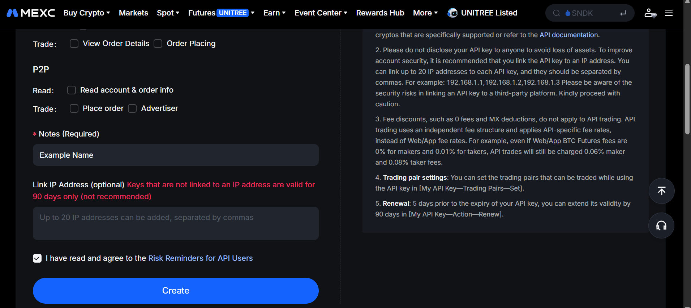
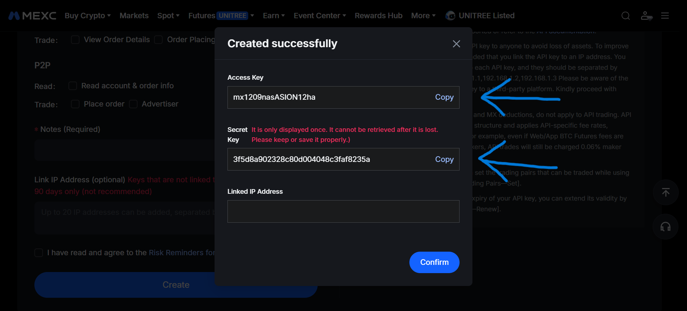

# API Keys Setup

## Create API Credentials

You can get your API keys from the [MEXC website](https://www.mexc.com/user/openapi):

| 1) Create API keys | 2) Copy Access & Secret key |
| ----------------- | ------------------------ |
|  |  |


## Environment Variables

The recommended setup is environment variables:

```bash
export MEXC_ACCESS_KEY="your_access_key"
export MEXC_SECRET_KEY="your_secret_key"
```

## Direct Usage

You can also pass credentials directly:

```python
from typed_mexc import MEXC

async with MEXC.new(
  api_key="your_access_key",
  api_secret="your_secret_key",
) as client:
  account = await client.spot.account.info()
  print(account['accountType'])
```

## Security Notes

1. Never commit credentials to git, issue trackers, logs, notebooks, or shared terminals.
2. Prefer read-only keys for development and documentation examples.
3. Use separate keys for production automation, manual trading, and local experiments.
4. Keep withdrawal permission disabled unless the exact workflow requires it.
5. Keep futures trading permission separate from spot read access where your account setup allows it.
6. Restrict production keys by IP before enabling trading permission.
7. Rotate credentials after any suspected leak or after using them on an untrusted machine.
8. Keys without an IP whitelist expire after 90 days on MEXC.

## Troubleshooting

If authenticated requests fail:

1. Confirm the key has the required permissions.
2. Confirm your environment variables are loaded.
3. Confirm your IP whitelist configuration on the MEXC side.
4. Check [Error Handling](reference/error-handling.md) for the client error model.
